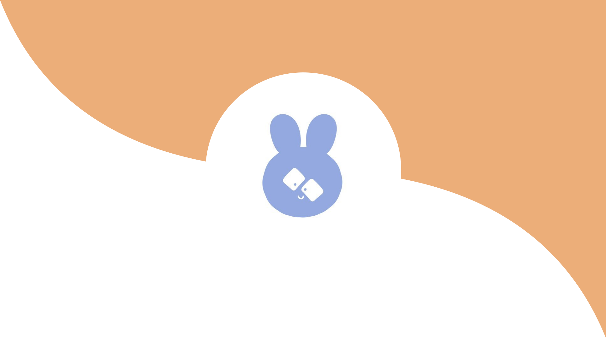

  

    
    
    
  

  

### Hi there 👋

***

### :hammer_and_wrench: Languages and Tools :

  &nbsp;
  &nbsp;
  &nbsp;
  &nbsp;
  &nbsp;
  &nbsp;
  &nbsp;
  &nbsp;
  

***

### :fire: My Stats :

***

### 🌸 Some of My Favorite Repos :
| Command | Description |
| --- | --- |
| git status | List all new or modified files |
| git diff | Show file differences that haven't been staged |
|Repo|Description|---|---|[`Eggy And Egglette`](https://github.com/bizbunny/EggyAndEgglette)|A bigger than usual game I'm making| 

***

## #30NitesOfCode:
  [Check out my progress!](https://www.codedex.io/@vnblacksheep60416/30-nites-of-code)  
  

<!--
**bizbunny/bizbunny** is a ✨ _special_ ✨ repository because its `README.md` (this file) appears on your GitHub profile.

Here are some ideas to get you started:

- 🔭 I’m currently working on ...
- 🌱 I’m currently learning ...
- 👯 I’m looking to collaborate on ...
- 🤔 I’m looking for help with ...
- 💬 Ask me about ...
- 📫 How to reach me: ...
- 😄 Pronouns: ...
- ⚡ Fun fact: ...
-->

